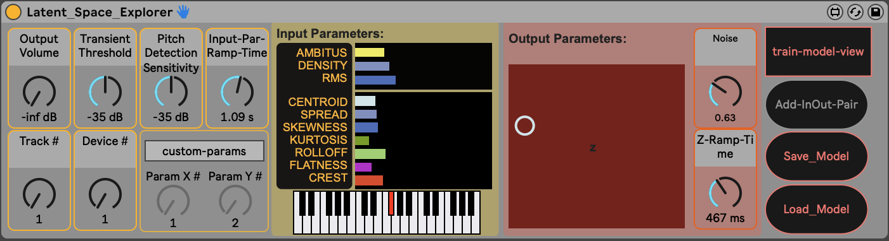

# Latent-Space-Explorer
Interactive rhythm generation with M4L.RhythmVAE

Markup : 

## Description
The Latent Space Explorer is a Max4Live Device that connects to another M4L Device: M4L.RhythmVAE from [Nao Tokui](https://github.com/naotokui "Nao Tokui GitHub"). Latent Space Explorer enables musicians to explore and walk through the latent space of M4L.RhythmVAE by just playing their instruments. A neural network inside Latent Space Controller "listens" to a musician and transforms the musical input to the 2D representation of the latent space. This neural net can be easily trained individually.
Furthermore it is possible to assign the xy-parameter-values to any other Ableton Live Device.

## Dependencies
1. [M4L.RhythmVAE for Intel-Chip](https://github.com/naotokui/RhythmVAE_M4L/tree/master/release "M4l.RhythmVAE for Intel Chip") or [M4L.RhythmVAE for Apple Silicon M1 Chip](https://github.com/naotokui/RhythmVAE_M4L/releases/tag/v0.73 "M4L.RhythmVAE for M1 Chip"). To open up M4L.RhythmVAE you can simply drag and drop the .amxd from Ableton Live´s Browser into a MIDI Track. 
  
2. Fluid Corpus Manipulation -> FluCoMa Max Package. You can download it directly from the Max Package Manager.

## Step by step guide

1. Open a new Ableton Live Set
2. Load the [M4L.RhythmVAE Device](##Dependencies "Goto Dependencies") into a MIDI Track and remember the track´s number.
3. Load a Standard Drum Kit into the same MIDI Track and place it after the M4L.RhythmVAE Device (e.g. Browser->Drums->707 Core Kit)
4. Load the Latent_Space_Explorer into an Audio-Track (this audio track must be a different one as the MIDI Track containing the M4L.RhythmVAE Device). This Audio-Track has to have    your microphone-Input and to be record enabled for live audio-input or you can load an audio-file and use this as audio-input.  
5. Configure the Latent_Space_Explorer:
    * __Volume:__ If you want to amplify the audio input signal, adjust the volume as you wish.
    * __Transient Threshold:__ To identify transients in the audio input signal and detect onsets of notes, adjust the transient threshold, depending on your input signals’ input gain.
    * __Pitch Detection Sensitivity:__ Depending on the audio input signals’ input gain you have to adjust the pitch detection sensitivity. You can check this by observing the key-slider, while you are playing. It should activate/show the pitch values in real-time.
    * __Rhythm-VAE Track #:__ This is the number of the track in which you loaded the M4L.RhythmVAE in step 2.
    * __Rhythm-VAE Device #:__ This is the number of the device inside the device chain of the track. In this case it should be the first device in the device chain starting whith index 0.
    * __custom Params:__ avtivating the custom params mode enables the user to assign the output x-y values (represented in the red 2d-slider) to two parameters of any device inside the Ableton Live Set. E.G. one can control the rate and width of a flanger.  
6. Train the Model
    * __Train-model-view:__ Detailed trainig view in a seperate patcher window. 
    * __Clear Dataset + Model:__ In most cases you want to clear the old dataset and model before you start training a new one.
    * __select - predict:__ For training you have to click on select. In this mode you select the current parameters as a possible new datapoint. Later, when the model is ready to go you have to click on predict, so that the model predicts the output based on the incoming data. 
    * __manually - auto:__ This refers to the input parameter and how they react. If you are playing an instrument, with live input or if you want to have an audio-signal to conrtol the input parameters, you have to click on auto. In the manual mode you can adjust the input parameters manually with your mouse/coursor. 
    *  __Add In/Out Pair:__ As soon as you have a combination of input and ouput parameters you can add this pair to the dataset. For convenience there is a second add-inout-pair button in the main window. Remember: by clicking this button the input parameters AND the output parameters are saved in the dataset. So for every input parameter constellation there is an output parameter constellation, which has to be set manually. 
    *  __Train the model:__ As soon as you collected enough in/out pairs you can train the model.
    *  __Saving and Loading Model:__ If the model is to your likings, you can save the model as a json file and reload it again.
7. Don´t forget to change the mode to predict and auto, when you are going to use the model in realtime while you are playing.

## Further Steps
- saving and loading datasets to expand or change existing datasets.
- More input parameters
